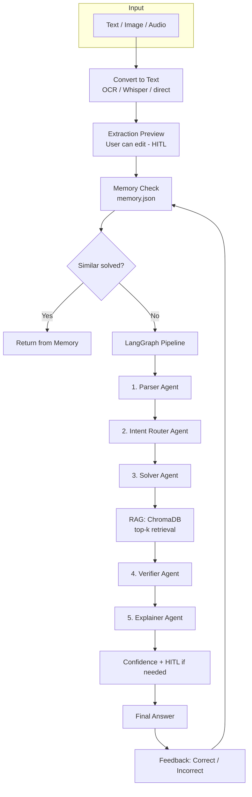

## Reliable Multimodal Math Mentor (RAG + Agents + HITL + Memory)

JEE-style math mentor: **multimodal input** (text, image OCR, audio), **5-agent LangGraph** pipeline, **RAG** (ChromaDB), **human-in-the-loop (HITL)**, and **self-learning memory**. Uses **OpenAI GPT-4o** (and Vision / Whisper) for parsing, solving, verification, and explanation.

### Architecture



### Features

| Requirement | Implementation |
|-------------|----------------|
| **Multimodal input** | Text, Image (GPT-4o Vision OCR), Audio (Whisper); extraction preview + edit before solve |
| **Parser agent** | Cleans input → structured `problem_text`, `topic`, `variables`, `constraints`, `needs_clarification` |
| **Intent router** | Classifies topic (algebra / probability / calculus / linear_algebra) and routes workflow |
| **RAG** | ChromaDB over `knowledge_base/*.txt`; top-k=3; retrieved context shown in sidebar; no citation when empty |
| **Solver** | Uses RAG context + GPT-4o for step-by-step solution |
| **Verifier** | Checks correctness / units / edge cases; returns APPROVED / REJECTED / UNCERTAIN (→ HITL) |
| **Explainer** | Student-friendly step-by-step explanation; incorporates verifier critique if rejected/uncertain |
| **HITL** | Triggered when parser sets `needs_clarification`, or verifier returns UNCERTAIN; user can edit question, approve/reject solution; corrections stored in memory |
| **Memory** | `memory.json`: question, answer, topic, verifier_outcome, user_feedback; reused for similar questions |
| **UI** | Input mode selector, extraction preview, agent trace, retrieved context panel, confidence indicator (Verified / Rejected / Uncertain), ✅ / ❌ feedback |

### Setup

1. **Install**

   ```bash
   pip install -r requirements.txt
   ```

2. **API key**

   - Copy `.env.example` to `.env` and set `OPENAI_API_KEY=sk-...`
   - On **Hugging Face Spaces**: **Settings → Variables and secrets** → Secret `OPENAI_API_KEY` → restart Space

3. **RAG (optional)**

   ```bash
   python -m src.rag
   ```

   Uses `knowledge_base/*.txt` (algebra, probability, calculus, linear algebra). Without a built DB, the app still runs (solver gets no RAG context).

4. **Run**

   ```bash
   streamlit run app.py
   ```

### Deployed app

- **Hugging Face Space:** [zaidkhan/math_mentor](https://huggingface.co/spaces/zaidkhan/math_mentor)

### Repo layout

- `app.py` — Streamlit UI, memory, HITL, feedback
- `src/agents.py` — LangGraph: Parser → Intent Router → Solver → Verifier → Explainer
- `src/rag.py` — ChromaDB build + retriever (empty retriever when no DB)
- `src/utils.py` — LLM, embeddings, OCR, Whisper
- `knowledge_base/*.txt` — JEE-style reference docs
- `memory.json` — Stored Q&A and feedback (created at runtime)
- `.env.example` — Template for `OPENAI_API_KEY`
